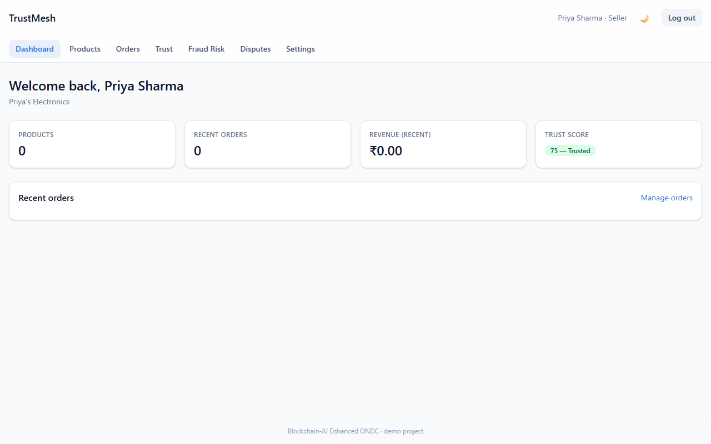
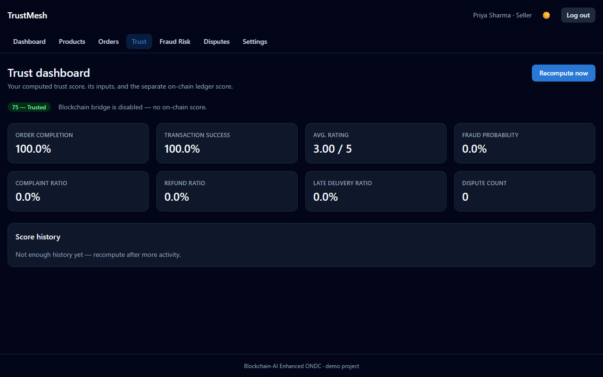
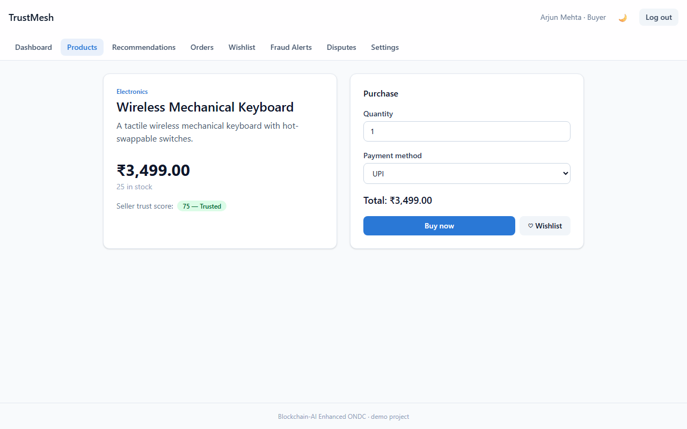
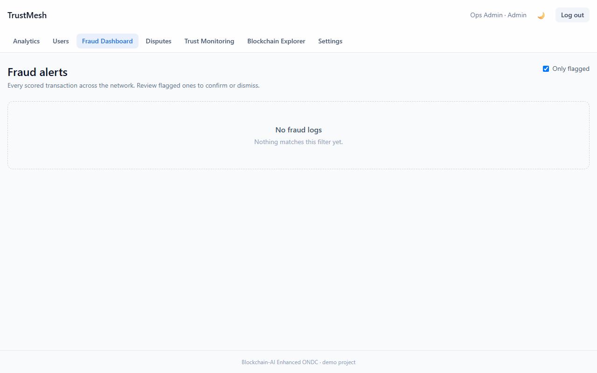

# TrustMesh — Blockchain-AI Trust Layer for ONDC

A marketplace trust layer for the Open Network for Digital Commerce (ONDC):
buyers, sellers and admins on a FastAPI + React platform where every seller
carries a live **trust score**, risky transactions are **flagged for fraud**,
recommendations weigh **seller trust and proximity**, and disputes are
settled through **on-chain escrow**.

**Live:** [frontend](https://ondc-frontend.onrender.com) ·
[API](https://ondc-backend-5kxh.onrender.com) (Render free tier — the first
request may take a minute to wake up)

FastAPI · PostgreSQL · Redis · React + TypeScript · Solidity / Hardhat · Web3.py · Scikit-learn · Docker · GitHub Actions

## The problem

Open commerce networks connect buyers to many independent sellers, but a
buyer has little to go on when choosing between them, and disputes depend on
whoever holds the money. TrustMesh explores making seller reputation and
dispute settlement **transparent and tamper-evident**, with ML handling the
parts that need judgement (fraud risk, recommendations).

## What it does

| Area | How it works |
|---|---|
| **Trust scoring** | Multi-factor score per seller (completion rate, ratings, complaints, refunds, late deliveries, fraud probability, disputes, seller age), stored as a time series |
| **Fraud detection** | Random Forest classifier on transaction, buyer and seller-trust features, plus explicit rule-based detectors (duplicate accounts, order-velocity bursts) |
| **Recommendations** | Hybrid recommender — TF-IDF content similarity, item-based collaborative filtering, seller-trust and proximity blending, popularity fallback for cold start — plus a "compare sellers" view |
| **Disputes & escrow** | `EscrowDispute.sol` holds buyer funds per order and releases, splits or arbitrates them; the backend mirrors the resolution rules |
| **Decentralised identity** | Wallet sign-in via a signed challenge, alongside JWT auth with refresh-token rotation |
| **Roles** | Buyer, seller and admin dashboards; admin analytics, user management and fraud review |

## Screenshots

| Seller dashboard | Seller trust dashboard |
| --- | --- |
|  |  |

| Buyer product detail | Admin fraud dashboard |
| --- | --- |
|  |  |

More in [`documentation/screenshots/`](documentation/screenshots/).

## Architecture

```
React + TypeScript (Vite, TanStack Query)
            │  REST /api/v1  (types generated from OpenAPI)
            ▼
FastAPI ── SQLAlchemy / Alembic ──► PostgreSQL
   │   └── Redis (caching, token revocation)
   ├── ML services: fraud model · trust score · recommender · dispute rules
   └── Web3.py bridge ──► TrustScore.sol · EscrowDispute.sol (Hardhat)
```

The blockchain bridge is best-effort: if no chain is configured, orders,
deliveries and disputes still work and on-chain calls are skipped.

## Repository layout

| Path | What's there |
|---|---|
| [`backend/`](backend/README.md) | FastAPI app, models, migrations, ML services, tests — **start here** |
| [`frontend/`](frontend/README.md) | React + TypeScript client (Vitest unit tests, Playwright E2E) |
| `contracts/`, `test/`, `scripts/` | Solidity contracts, Hardhat tests and deploy script |
| [`documentation/`](documentation/README.md) | Project report, architecture diagrams, schema, algorithms, test results |
| [`deployment/`](deployment/README.md) | Docker and Render deployment notes |
| `app.py`, `pages/`, `ml/`, `blockchain/` | Earlier Streamlit prototype (see below) |

## Run it locally

```bash
# Backend — Postgres + Redis via Docker
cd backend
pip install -r requirements.txt
cp .env.example .env
docker compose -f docker-compose.dev.yml up -d
alembic upgrade head
uvicorn app.main:app --reload          # http://localhost:8000/docs

# Frontend
cd ../frontend
npm install
cp .env.example .env.local
npm run dev                             # http://localhost:5173

# Smart contracts
npm install && npx hardhat test
```

Backend tests run against in-memory SQLite (`cd backend && pytest -v`).
GitHub Actions runs the backend, frontend and contract test suites on every
push.

## A note on data

No public ONDC transaction or fraud dataset exists, so the fraud model is
trained on **synthetic transactions** with an engineered signal. Reported
model metrics describe performance on that synthetic data — they show the
approach works end to end, not real-world ONDC fraud rates.

---

## Earlier Streamlit prototype

Before the FastAPI + React system, the concepts were prototyped as a
Streamlit dashboard, kept at the repo root for reference. Its KPI numbers
come from its own synthetic simulation and describe only that prototype.

Prototype for **Project 3: Blockchain-AI Enhanced ONDC Implementation** — a
decentralized trust-scoring and dispute-resolution layer for the Open Network
for Digital Commerce (ONDC), combined with AI-driven fraud detection and
personalized buyer-seller matching.

A multipage Streamlit dashboard ties together four pieces:

1. **Blockchain trust ledger** — a hash-chained event log (successful
   deliveries, disputes, fraud flags) that deterministically computes a
   0-100 trust score per seller. Tampering with a past event is detectable
   because it breaks the hash chain. Seeded with simulated history on load
   so it reads as an active network, with a "simulate activity" control and
   a live activity feed.
2. **AI fraud detection** — a Random Forest classifier trained on
   transaction, buyer, and seller-trust features.
3. **Recommendation engine** — content-based product/service matching that
   blends category relevance, price fit, and on-chain seller trust.
4. **Automated dispute resolution** — rules that split escrowed funds
   between buyer and seller based on trust score and submitted evidence.

The same trust-scoring and escrow/dispute rules are implemented as Solidity
smart contracts (`contracts/TrustScore.sol`, `contracts/EscrowDispute.sol`)
for real deployment to an Ethereum testnet.

### What's live data vs. simulated

No public ONDC transaction/fraud dataset exists, so the fraud model and
recommender train on **synthetic data** (`ml/data.py`) with a deliberately
engineered signal (seller trust, dispute history, transaction velocity,
payment method, etc. drive fraud likelihood). The numbers reported in the
dashboard are real evaluation results *on that synthetic data* — a working
demonstration of the approach, not a claim about real-world ONDC fraud
rates. Swap in real network data before treating the KPIs as production
numbers.

The Trust Ledger page runs a pure-Python hash-chain simulation so it works
instantly with no wallet or RPC connection. The Solidity contracts in
`contracts/` implement the same rules for an actual testnet deployment —
see [Smart contracts](#smart-contracts) below.

### Getting started

```bash
pip install -r requirements.txt
streamlit run app.py
```

The sidebar has six pages: **Overview** (live network snapshot + KPI
status + activity feed) → **Trust Ledger** → **Fraud Detection** →
**Recommendations** → **Dispute Resolution** → **Smart Contracts**.

### KPI targets and where they're demonstrated

| KPI | Where | Notes |
|---|---|---|
| Smart contract deployment for trust scoring | `contracts/TrustScore.sol` | Deploy yourself via Hardhat — see below |
| AI model 85%+ accuracy in fraud detection | Fraud Detection page | ~93% accuracy on synthetic held-out test data |
| Recommendation engine CTR improvement 20%+ | Recommendations page | ~100%+ lift in the simulated CTR backtest |
| Blockchain transaction processing under 30s | Trust Ledger page | Sub-millisecond in the local simulation; real testnet block times are ~12s |
| Comprehensive testing on Ethereum testnet | `test/*.test.js` | Hardhat test suite — run locally or against Sepolia |

### Smart contracts

`TrustScore.sol` maintains a 0-100 on-chain score per participant, adjusted
by authorized reporters (e.g. the escrow contract) on events like
`successful_delivery` or `fraud_flagged`. `EscrowDispute.sol` holds buyer
funds per order, releases them on confirmed delivery, and — on a raised
dispute — either auto-resolves by splitting funds in proportion to each
party's trust score, or lets a designated arbitrator override the split.

`EscrowDispute.sol` was hardened after an initial audit pass: fund
transfers use OpenZeppelin's `ReentrancyGuard` plus an explicit
`call{value}(...)` + `require(success)` pattern (`_sendFunds`) instead of
the older `.transfer()` — `.transfer()`'s fixed 2300-gas stipend reverts
unpredictably against any recipient whose receive/fallback needs more
than that, a real risk for a contract meant to send funds to arbitrary
addresses (a multisig, a proxy wallet) years into the future. State
(order status, the trust-score event) already settled before every fund
transfer even before this change — checks-effects-interactions — so the
guard is genuine defense in depth, not the only thing preventing
reentrancy; see the comments in `_settle`/`confirmDelivery` for the full
reasoning, and `test/EscrowDispute.test.js`'s "reverts cleanly if the
fund transfer to the recipient fails" test for what the change actually
proves (a rejecting recipient now fails loudly with a clear message
instead of silently). Requires Solidity 0.8.20+ (bumped from 0.8.19 for
OpenZeppelin 5's `ReentrancyGuard`) — both contracts declare `pragma
solidity ^0.8.19`, so this is a compiler-version change, not a contract
source change.

```bash
npm install
npx hardhat test                 # run the contract test suite locally
npx hardhat node                 # local chain, in its own terminal
npx hardhat run scripts/deploy.js --network localhost   # deploy locally

cp .env.example .env             # fill in SEPOLIA_RPC_URL and PRIVATE_KEY
npx hardhat run scripts/deploy.js --network sepolia
```

Each deploy writes addresses to `deployments/<network>.json` — that's how
`backend/app/blockchain/client.py` finds the contracts without a hardcoded
address per environment. Deploying to Sepolia requires your own RPC
endpoint (e.g. Alchemy/Infura) and a funded testnet wallet; the local
deploy above has been run and verified end-to-end against the backend
(see `backend/README.md`'s blockchain section) — Sepolia has not.

### Tech stack

Python, Streamlit, Pandas, NumPy, Scikit-learn, Plotly · Solidity 0.8,
Hardhat, Ethers.js, Chai/Mocha

### Files

| File/dir | Purpose |
|---|---|
| `app.py` | Multipage entry point — page config, nav, theme init |
| `theme.py` | Validated color palette, Plotly template, shared UI components |
| `state.py` | Session state + cached data/model loaders shared across pages |
| `pages/1_home.py` | Overview — live network snapshot, KPI status, activity feed |
| `pages/2_trust_ledger.py` | Blockchain trust ledger simulation |
| `pages/3_fraud_detection.py` | Fraud model training + evaluation charts |
| `pages/4_recommendations.py` | Recommender preview + CTR backtest |
| `pages/5_dispute_resolution.py` | Dispute resolution rules explorer |
| `pages/6_smart_contracts.py` | Solidity contract viewer + deploy instructions |
| `blockchain/chain.py` | Hash-chained trust ledger implementation |
| `ml/data.py` | Synthetic ONDC transaction/catalog/buyer generators |
| `ml/fraud_model.py` | Random Forest fraud classifier + evaluation metrics |
| `ml/recommender.py` | Content-based recommender + CTR backtest |
| `ml/dispute_resolution.py` | Trust/evidence-based settlement rules |
| `contracts/TrustScore.sol` | On-chain trust-scoring contract |
| `contracts/EscrowDispute.sol` | On-chain escrow + dispute-resolution contract |
| `scripts/deploy.js` | Hardhat deployment script |
| `test/*.test.js` | Hardhat/Chai contract tests |

### Reference

IEEE paper: "Blockchain Meets AI: Future of Decentralized Digital Commerce
with ONDC" (referenced in the project brief; concepts adapted here rather
than reproduced).
