# Architecture and Diagrams

All diagrams are Mermaid — they render natively on GitHub and in most
modern markdown viewers. Every component named here corresponds to a real
file in the repository; none of this is aspirational.

## System architecture

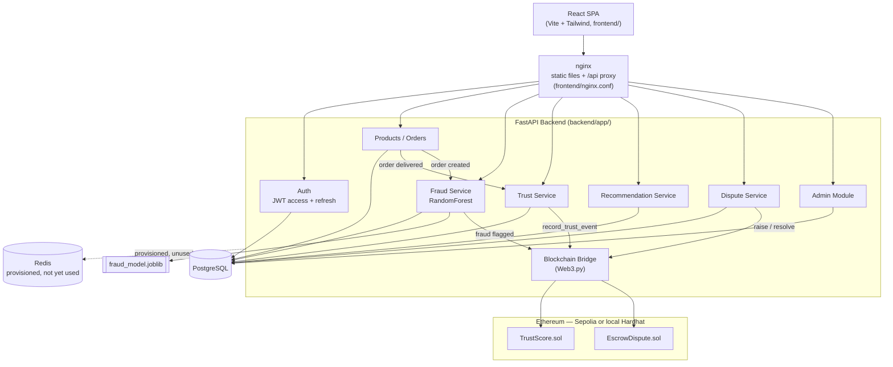

The blockchain bridge is best-effort by design: every arrow into `BRIDGE`
is caught-and-logged if the chain is disabled or unreachable, never a hard
dependency of the request that triggered it (see `backend/README.md`'s
design-decisions section).

## Data Flow Diagram (Level 1)

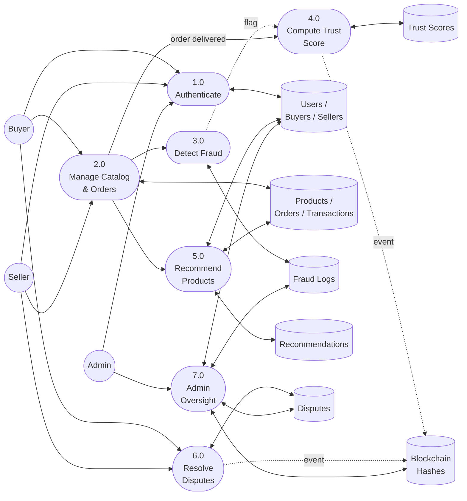

## Entity-Relationship Diagram

13 tables — the original 12 from `database/schema.sql` plus `wishlists`
(added for the buyer wishlist feature; see
[03_database_schema.md](03_database_schema.md)).

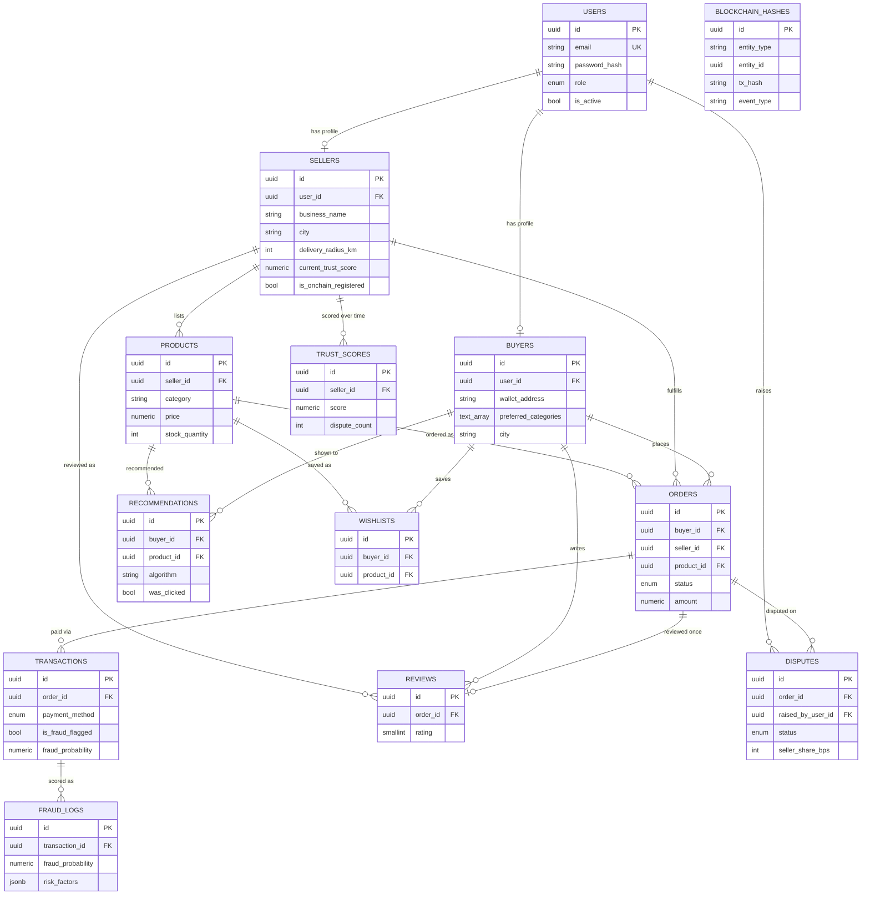

`blockchain_hashes` references other rows by `(entity_type, entity_id)`
rather than a typed foreign key — deliberate, since it's a single
append-only audit trail for events on several different entity types
(sellers today; orders/disputes as the blockchain bridge grows), not
scoped to one table.

## Sequence Diagram — Placing an order (fraud scoring + optional on-chain event)

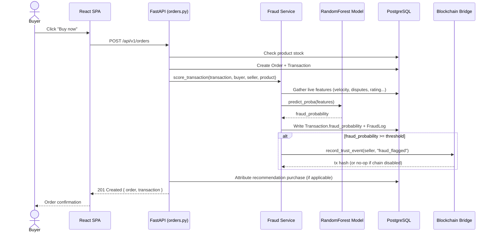

## Sequence Diagram — Dispute lifecycle

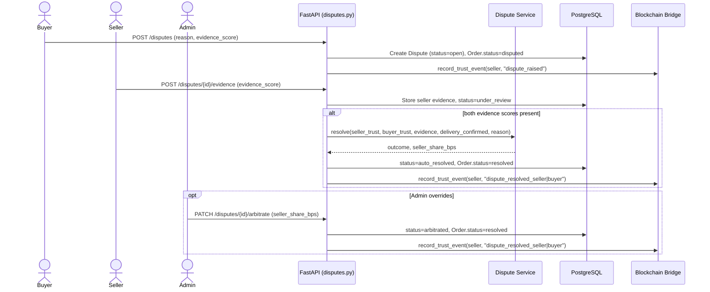

## Use Case Diagram

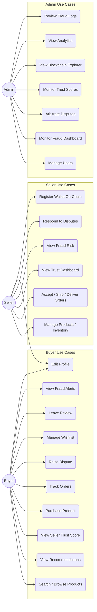

## Class Diagram (core domain models)

Mirrors `backend/app/models/` — the SQLAlchemy ORM classes — not a
speculative design; every field shown exists in the actual model.

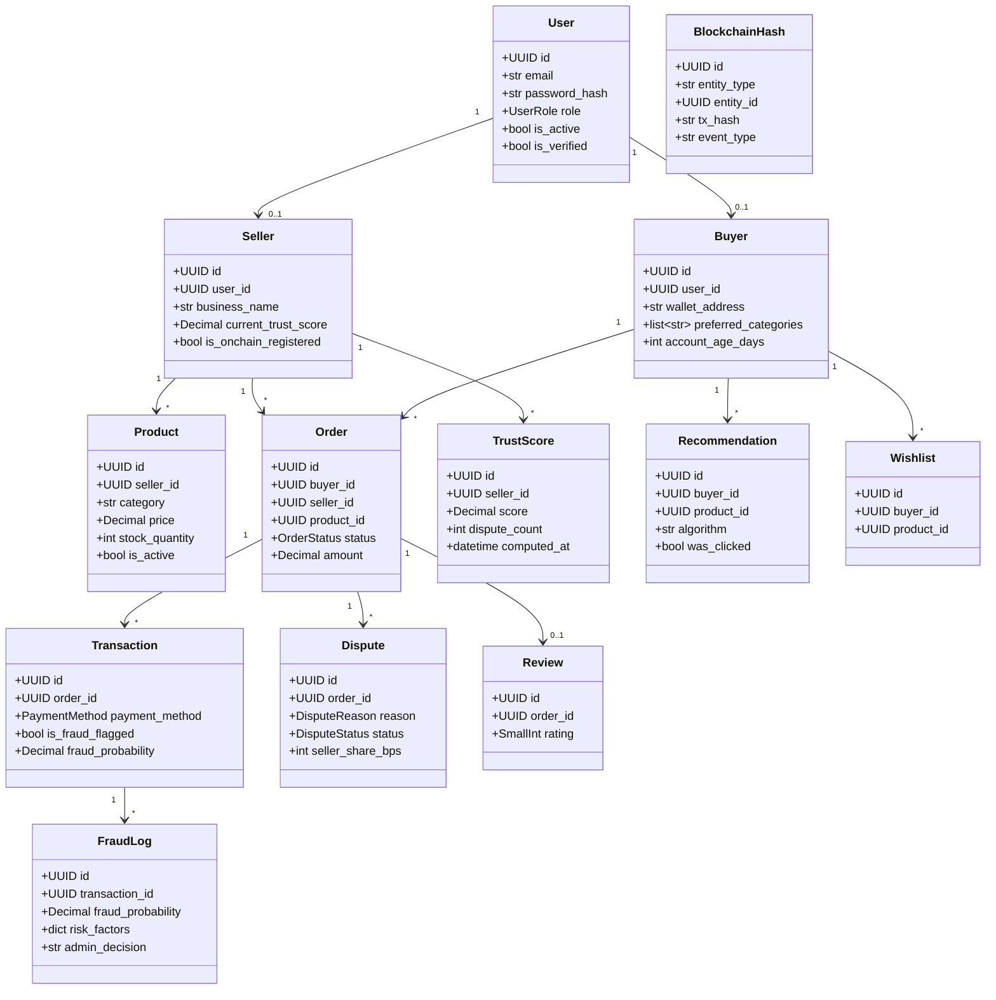

## Deployment Diagram

Matches `docker-compose.yml` exactly — see
[deployment/README.md](../deployment/README.md) for what's actually been
run vs. reviewed-but-not-executed.

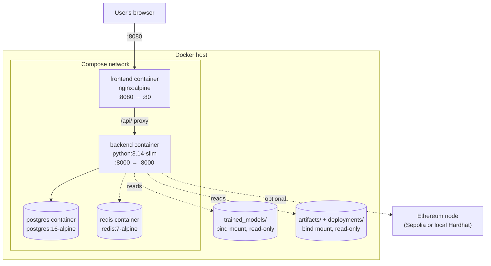

## Flowchart — Order status state machine

Enforced server-side in `backend/app/api/v1/endpoints/orders.py`
(`ALLOWED_TRANSITIONS`), not left to the client to get right.

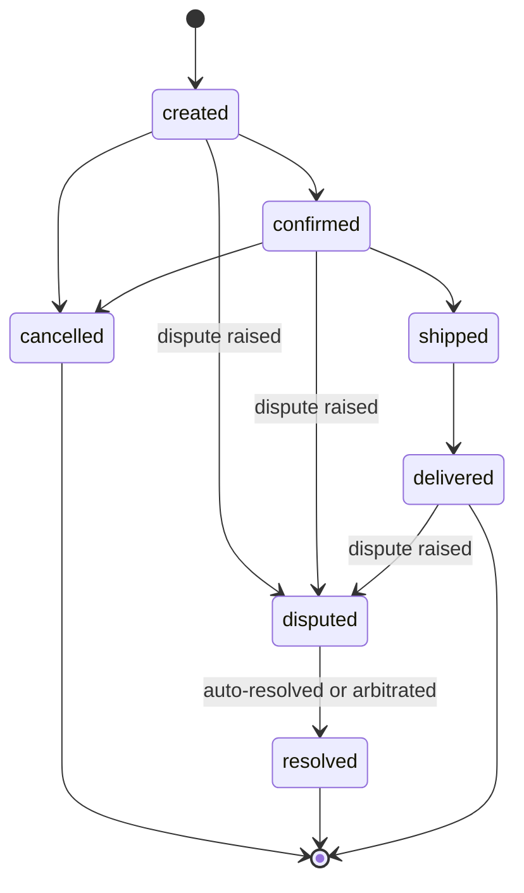

Cancelling from `created`/`confirmed` restocks the product.
`disputed`/`resolved` are reachable only through the dispute-resolution
flow (`disputes.py`), never through the seller's own status-update
endpoint — a deliberate separation of concerns.

## Flowchart — Fraud detection decision

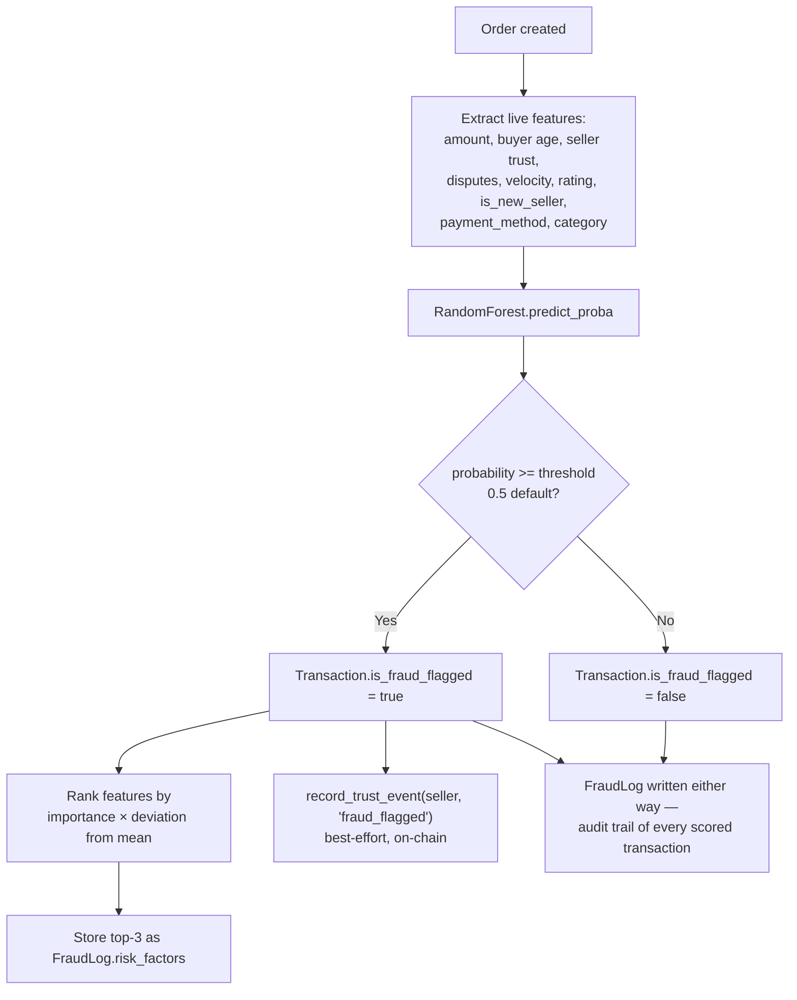

## Flowchart — Dispute auto-resolution

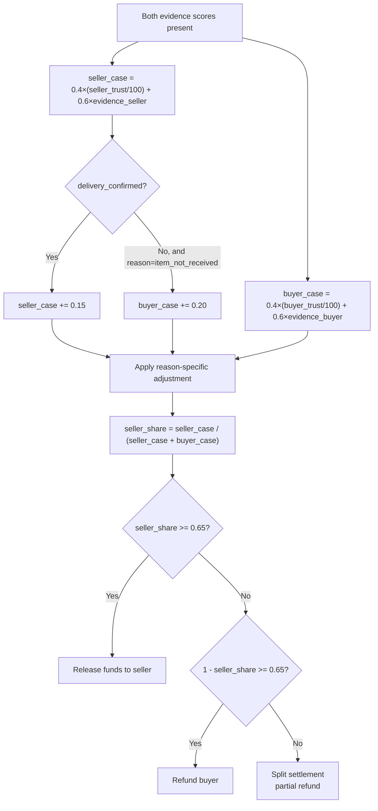
